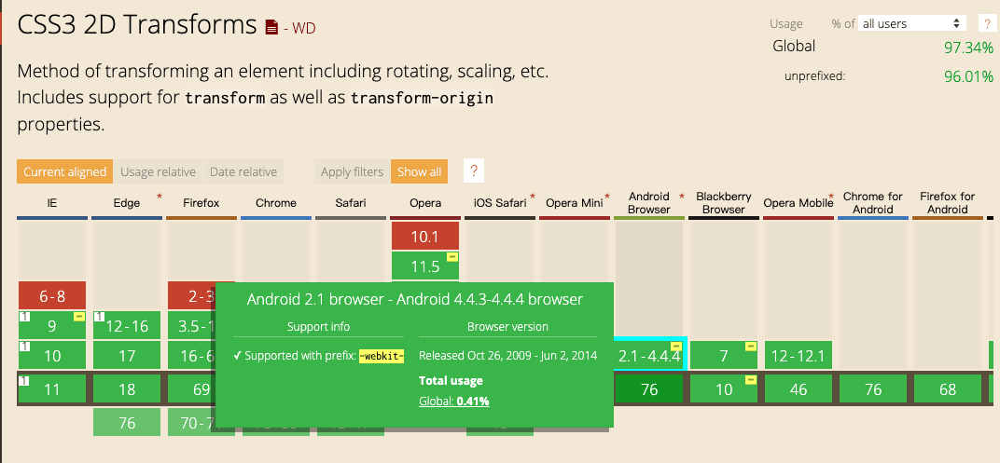

# Android 4.4.2不兼容CSS3特性

### Bug场景

Android客户端webview内嵌H5，需要兼容到4.*版本。用App访问本地环境时，是完全ok的，但正式环境就会出问题，CSS写的箭头，方向不对，还有引入mint-ui的time picker也有错位的问题。

### 分析问题

通过表象很明确定位到是CSS3 transform属性没写浏览器兼容性前缀导致的问题，在[can i use](https://caniuse.com/)查的结果也证实了猜测，如图：



至此问题很明确，要想兼容Android 4就要加-webkit-前缀

### 解决问题

直接在css中直接添加-webkit-前缀

```css
    -webkit-transform: rotate(135deg) translateY(0.75rem);
    transform: rotate(135deg) translateY(0.75rem);
```

这样就解决了箭头的问题，但引入第三方mint-ui中的time picker错位问题并没有解决。还要想办法。

通过上网查到vue cli build打包后是否添加前缀，取决于[browserslist](https://github.com/browserslist/browserslist)，因为autoprefixer将其作为依赖了。如下更改package.json中的配置，即可。

```js
"browserslist": [
  "> 1%",
  "last 2 versions",
  "last 10 Chrome versions",
  "last 5 Firefox versions",
  "Safari >= 6",
  "ie > 8"
]
```