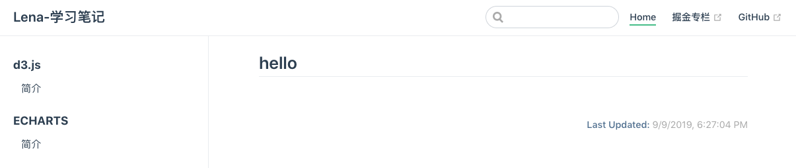
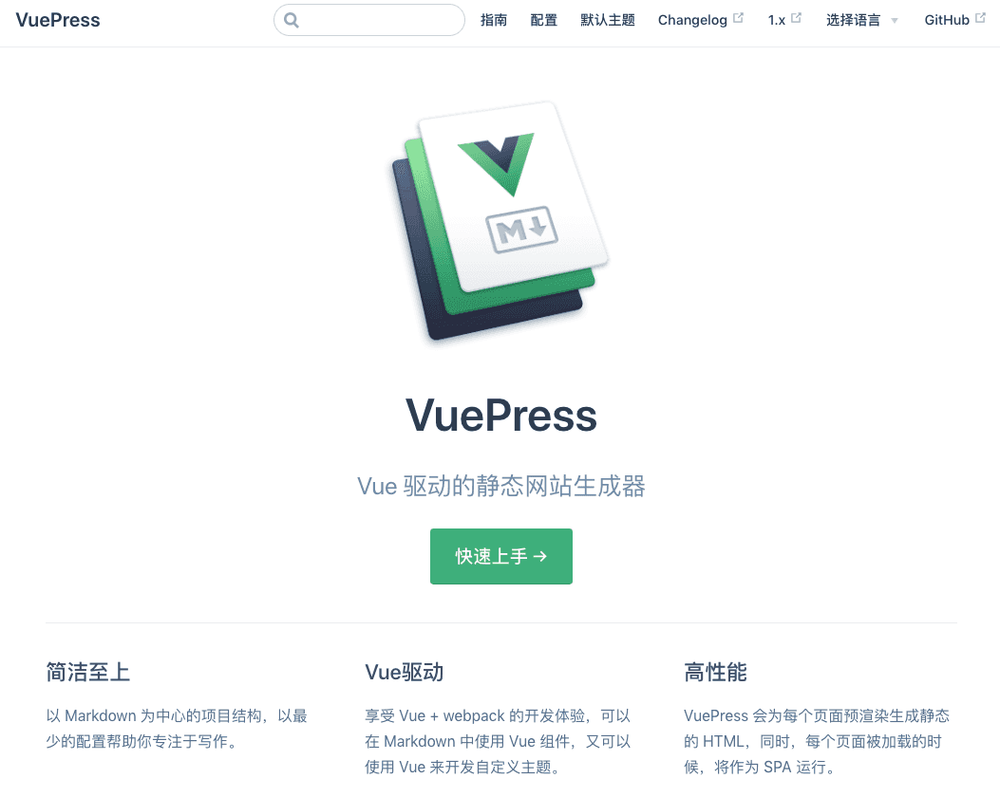

# 通过 TravisCI 自动化部署 VuePress 到 GithubPages

这篇文章主要介绍了如何利用 Github 搭建自己的博客网站，如何利用[VuePress](https://vuepress.vuejs.org)书写技术文档以及如何利用[TravisCI](https://travis-ci.com/)自动化部署 Github 博客网站。

### Github 创建博客仓库

1. 如果要部署到https://{your-github-name}.github.io地址上，需要创建以{your-github-name}.github.io为名字的仓库
2. 如果部署到https://{your-github-name}.github.io/{repo-name}/地址上，要创建{repo-name}仓库。

本文是第二种，创建了`learn`仓库。将创建好的项目克隆项目到本地。

### 使用 VuePress 搭建文档

初始化项目，并安装 VuePress 为本地依赖

```sh
# 用yarn初始化项目
yarn init

# 新建一个文件夹，本文是docs
mkdir docs

# 新建一个 markdown 文件
echo '# hello' > docs/README.md
```

接着，在`package.json`里加一些脚本：

```json
{
  "scripts": {
    "blog:dev": "vuepress dev docs", //'vuepress dev docs'处的docs需要和新创文件夹的名字一致
    "blog:build": "vuepress build docs"
  }
}
```

然后就可以开始写作了：

```sh
yarn blog:dev
```

要生成静态的 HTML 文件，也就是打包的话，运行：

```sh
yarn blog:build
```

当你成功完成以上步骤，那恭喜你已经实现了VuePress 的第一步。之后我们要对 vuepress 进行配置，以实现进一步的需求。

在 docs 目录下创建一个`.vuepress`目录，所有 VuePress 相关的文件都将会放在这里。你的项目结构可能是这样：

```
.
├─ docs
│  ├─ README.md //打开网站后默认访问的文件，之后我们可以作为首页
│  └─ .vuepress
│     └─ config.js //VuePress网站必要的配置文件
└─ package.json

```

`.vuepress/config.js`应该导出一个 JavaScript 对象：

```js
const sidebarRouter = require("./router");

module.exports = {
  base: "/learn/", //注意此处的路径前后都要有符号/，且其他涉及路径的地方直接写/{文件名称}即可，如/d3，都转为/learn/d3
  title: "Lena-学习笔记", //网站左上角显示的title
  description: "Good good study, day day up!", //网站的描述
  head: [
    ["link", { rel: "icon", href: "/favicon.ico" }] //网站页卡显示的favicon图片
  ],
  markdown: {
    lineNumbers: true //代码里是否显示代码行数
  },
  themeConfig: {
    lastUpdated: "Last Updated",
    nav: [
      //导航条的配置
      { text: "Home", link: "/" },
      {
        text: "掘金专栏",
        link: "https://juejin.im/user/5916ab218d6d8100586bb776/posts"
      },
      { text: "GitHub", link: "https://github.com/liweina-fans/learn" }
    ],
    sidebar: [
      {
        title: "d3.js",
        collapsable: false,
        children: [["/echarts/basic", "简介"]]
      },
      {
        title: "ECHARTS",
        collapsable: false,
        children: [["/d3/basic", "简介"]]
      }
    ] //左边侧边栏的配置路由
  }
};
```
更详细的配置可参考[VuePress基本配置](https://vuepress.vuejs.org/zh/guide/basic-config.html#配置文件)  

到此我们就实现了一个这样的网站页面：


有没有发现一个问题，就是并没有默认路由，内容显示的是`docs/README.md`的内容。那我们怎么实现默认路由以及首页的效果呢，就像VuePress网站打开首页的效果:  



哈哈，其实这个问题很简单，就是利用起`docs/README.md`，内容如下：  

```js
---
home: true
heroImage: /avatar.jpeg
actionText: 笔记详情 →
actionLink: d3/basic  //默认路由
features:
- title: 学习笔记
  details: 整理和总结学习的知识，包括但不限于Vue、React、可视化库，还有日常开发踩坑...
- title: 学习兴趣
  details: 掘金看看文章，leetcode算法，保持技术的前沿性...
- title: 个人介绍
  details: 主要技术：javascript基础、vue、react等框架、node服务、小程序...
footer: MIT Licensed | Copyright © 2019-present liweina
---

### star
如果感觉对您有帮助，请不要吝啬点个star，作者感谢o(￣︶￣)o  liweina
```
有没有感觉自己的网站瞬间档次提高了😆


### TravisCI自动化部署

Github仓库已建好，我们的VuePress文档也写好了，那如何部署呢？

1. 脚本部署。在根目录下创建脚本文件`deploy.sh`，每次写完文档执行命令`sh deploy.sh`即可。

```sh
#!/usr/bin/env sh

# 确保脚本抛出遇到的错误
set -e

# 生成静态文件
npm run blog:build

# 进入生成的文件夹
cd docs/.vuepress/dist

# 如果是发布到自定义域名
# echo 'www.example.com' > CNAME

git init
git add -A
git commit -m 'deploy'

git push -f git@github.com:liweina-fans/learn.git master:gh-pages

cd -
```
有没有发现除了代码仓库提交代码外，还要单独执行部署脚本，那有没有自动化工具，当我向仓库提交代码时，就能自动化部署呢？答案当然是肯定的，咱们继续往下看 :point_down:  

2. 自动化部署


.
+-- docs
| +-- README.md
| +-- .vuepress
+-- config.js
+-- package.json
