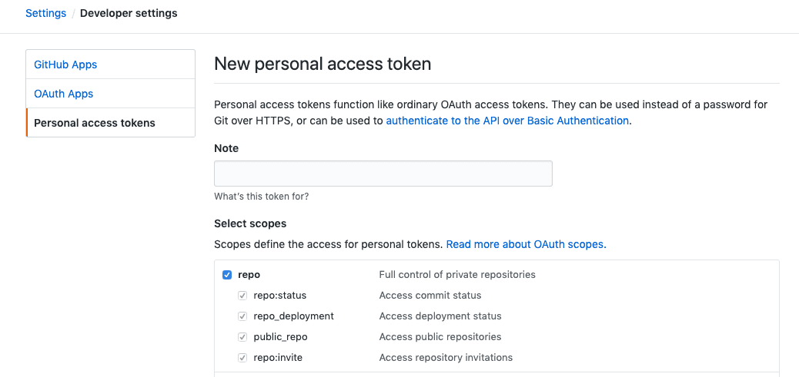

# 通过 TravisCI 自动化部署 VuePress 到 GithubPages

这篇文章主要介绍了如何利用 Github 搭建自己的博客网站，如何利用[VuePress](https://vuepress.vuejs.org)书写技术文档以及如何利用[TravisCI](https://travis-ci.com/)自动化部署 Github 博客网站。

### Github 创建博客仓库

1. 如果要部署到https://{your-github-name}.github.io地址上，需要创建以{your-github-name}.github.io为名字的仓库
2. 如果部署到https://{your-github-name}.github.io/{repo-name}/地址上，要创建{repo-name}仓库。

本文是第二种，创建了`learn`仓库。将创建好的项目克隆项目到本地。

### 使用 VuePress 搭建文档

初始化项目，并安装 VuePress 为本地依赖

```sh
# 用yarn初始化项目
yarn init

# 新建一个文件夹，本文是docs
mkdir docs

# 新建一个 markdown 文件
echo '# hello' > docs/README.md
```

接着，在`package.json`里加一些脚本：

```json
{
  "scripts": {
    "blog:dev": "vuepress dev docs", //'vuepress dev docs'处的docs需要和新创文件夹的名字一致
    "blog:build": "vuepress build docs"
  }
}
```

然后就可以开始写作了：

```sh
yarn blog:dev
```

要生成静态的 HTML 文件，也就是打包的话，运行：

```sh
yarn blog:build
```

当你成功完成以上步骤，那恭喜你已经实现了VuePress 的第一步。之后我们要对 vuepress 进行配置，以实现进一步的需求。

在 docs 目录下创建一个`.vuepress`目录，所有 VuePress 相关的文件都将会放在这里。你的项目结构可能是这样：

```
.
├── .gitignore
├── .travis.yml
├── README.md
├── _config.yml
├── deploy.sh
├── docs
│   ├── .vuepress
│   │   ├── config.js  //VuePress网站必要的配置文件
│   │   ├── public     //放置公共图片，如avatar和favicon.ico
│   ├── README.md      //打开网站后默认访问的文件，之后我们可以作为首页
│   ├── blog           //blog、d3、echarts和vue为文档目录
│   │   ├── VuePress_GithubPages_TravisCI
│   │   └── license
│   ├── d3
│   │   └── basic.md
│   ├── echarts
│   │   └── basic.md
│   └── vue
│       ├── images
│       └── keep-alive.md
├── package.json
└── yarn.lock

```

`.vuepress/config.js`应该导出一个 JavaScript 对象：

```js
const sidebarRouter = require("./router");

module.exports = {
  base: "/learn/", //注意此处的路径前后都要有符号/，且其他涉及路径的地方直接写/{文件名称}即可，如/d3，都转为/learn/d3
  title: "Lena-学习笔记", //网站左上角显示的title
  description: "Good good study, day day up!", //网站的描述
  head: [
    ["link", { rel: "icon", href: "/favicon.ico" }] //网站页卡显示的favicon图片，其存放路径为'docs/.vuepress/public/favicon.ico'
  ],
  markdown: {
    lineNumbers: true //代码里是否显示代码行数
  },
  themeConfig: {
    lastUpdated: "Last Updated",
    nav: [
      //导航条的配置
      { text: "Home", link: "/" },
      {
        text: "掘金专栏",
        link: "https://juejin.im/user/5916ab218d6d8100586bb776/posts"
      },
      { text: "GitHub", link: "https://github.com/liweina-fans/learn" }
    ],
    sidebar: [
      {
        title: "d3.js",
        collapsable: false,
        children: [["/echarts/basic", "简介"]]
      },
      {
        title: "ECHARTS",
        collapsable: false,
        children: [["/d3/basic", "简介"]]
      }
    ] //左边侧边栏的配置路由
  }
};
```
更详细的配置可参考[VuePress基本配置](https://vuepress.vuejs.org/zh/guide/basic-config.html#配置文件)  

到此我们就实现了一个这样的网站页面：


有没有发现一个问题，就是并没有默认路由，内容显示的是`docs/README.md`的内容。那我们怎么实现默认路由以及首页的效果呢，就像VuePress网站打开首页的效果:  


哈哈，其实这个问题很简单，就是利用起`docs/README.md`，内容如下：  

```js
---
home: true
heroImage: /avatar.jpeg
actionText: 笔记详情 →
actionLink: d3/basic  //默认路由
features:
- title: 学习笔记
  details: 整理和总结学习的知识，包括但不限于Vue、React、可视化库，还有日常开发踩坑...
- title: 学习兴趣
  details: 掘金看看文章，leetcode算法，保持技术的前沿性...
- title: 个人介绍
  details: 主要技术：javascript基础、vue、react等框架、node服务、小程序...
footer: MIT Licensed | Copyright © 2019-present liweina
---

### star
如果感觉对您有帮助，请不要吝啬点个star，作者感谢o(￣︶￣)o  liweina
```
**注意**：avatar.jpeg的存放路径为`docs/.vuepress/public/avatar.jpeg`，有没有感觉自己的网站瞬间高大上些了😆


### TravisCI自动化部署

Github仓库已建好，我们的VuePress文档也写好了，那如何部署呢？

#### 1. 脚本部署。在根目录下创建脚本文件`deploy.sh`，每次写完文档执行命令`sh deploy.sh`即可。

```sh
#!/usr/bin/env sh

# 确保脚本抛出遇到的错误
set -e

# 生成静态文件
npm run blog:build

# 进入生成的文件夹
cd docs/.vuepress/dist

# 如果是发布到自定义域名
# echo 'www.example.com' > CNAME

git init
git add -A
git commit -m 'deploy'

git push -f git@github.com:liweina-fans/learn.git master:gh-pages

cd -
```
有没有发现除了代码仓库提交代码外，还要单独执行部署脚本，那有没有自动化工具，当我向仓库提交代码时，就能自动化部署呢？答案当然是肯定的，咱们继续往下看 :point_down:  

#### 2. 自动化部署

##### 创建配置文件
在项目根目录下创建travis-ci的配置文件`.travis.yml`, travis-ci根据这个文件自动编译部署。  

```json
language: node_js
node_js:
    - "lts/*"   //此行需注意使用lts版本的nodejs
cache: yarn
install:
    - yarn
script:
   - yarn blog:build
deploy:
    provider: pages
    skip-cleanup: true
    github-token: $GITHUB_TOKEN
    local-dir: ./docs/.vuepress/dist/
    target-branch: gh-pages
    verbose: true
    on:
      branch: master
```

##### 设置travis-ci.org

1. 获取token。通过登录Github -> settings -> Developer settings -> Personal access tokens -> Generate new token, 依据[travis文档](https://docs.travis-ci.com/user/deployment/pages/),我们需要允许`repo`一项的权限。如下图：
  

2. 登录[travis网站](https://travis-ci.org), 个人比较习惯Sign in with Github，之后就可以获取到Github中的仓库列表。打开仓库的`setting`项，在`Environment Variables`条目下添加`GITHUBU_TOKEN`变量，变量值就是上一步获取的token。


##### 提交代码到github
在根目录下输入以下命令：

```js
git init
git add .
git commit -m '{comment}'
git push -u origin master
```
travis-ci检测到项目的提交，就会根据.travis.yml文件去编译项目，最后把生成的静态文件推送到仓库的gh-pages分支，然后访问对应的目录就能看到生成的静态网站。本文生成的[地址](https://liweina-fans.github.io/learn/)。

以后有新的改动，只需要执行最后一步提交代码的命令，travis-ci就会自动编译部署
::: tip
总结：搭建该博客网站虽遇到了些问题，但通过查文档还是找到了解决方法，并搭建成功。如果哪里有写的不详细或有缺陷，又或者没有提到可能会遇到的问题，愿与君一起探讨，在此谢过:pray:
:::

