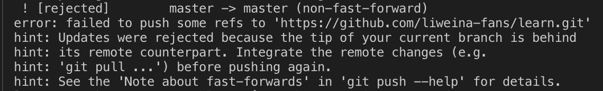

# 提交 Github 不显示贡献小绿块解决方法

### 问题：
最近一直在用Github写博客，但发现Github上的contributions记录并没有绿块显示。

### 原因：

在博客的本地仓库用`git log`查看commit记录，会发现虽然往你的Github仓库中push代码，但Author和 Email，并不是你Github的（Github邮箱查询方法：Settings -> Emails -> Primary email address）
所以，Github贡献统计根本就不是你的账户，所以就没有小绿块啦。

### 解决方法：

1. 如果只想以后的 commit 被记录在贡献力，只需要把当前本地 git 的 user.name 和 user.email 配置一下即可：

```js
$ git config --global user.name "{github name}"
$ git config --global user.email "{github email}"
```

2. 如果不想浪费之前的commit贡献，需要修改所有commit和push历史，都归为你真正的名下即可：

```js
$ git filter-branch -f --env-filter "
GIT_AUTHOR_NAME='{new name}';
GIT_AUTHOR_EMAIL='{new email}';
GIT_COMMITTER_NAME='{new name}';
GIT_COMMITTER_EMAIL='{new email}'
" HEAD
```

如果修改成功提示: `Ref 'refs/heads/master' was rewritten`，当`git log`时，Author和 Email均为最新配置的。

之后我们需要重新提交这些commit记录
```js
$ git push origin master
```
但此时会提示如下：


::: warning
将本地git的账户和邮箱重新设置了，github并没有那么智能就能判断你是原来的用户。也就是说新配置的用户和之前的用户被github识别成两个用户。
:::

我们可以使用强制push的方法：
```js
$ git push -u origin master -f
```

至此，打开github.com，完美的展示了之前的贡献绿块 :smile:


