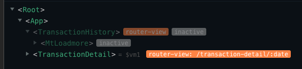
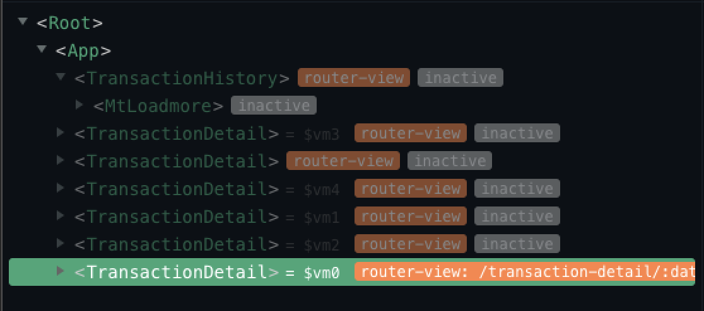

# 利用 keep-alive 实现前进刷新后退读取缓存

## 需求：

有三个页面 A、B、C。A 跳转 B，B 再跳转 C，然后 C 返回 B 的时候 B 需要缓存，B 返回 A 的时候 A 需要缓存。再由 A 进入 B 时需要重新刷新 B 的数据，B 进入 C 时，重新刷新 C 数据。也就是前进刷新，后退读取缓存数据。

具体点：

#### A 页面是一个商家的交易历史列表：

> 1. Day1 总交易额
> 2. Day2 总交易额
> 3. Day3 总交易额

#### B 页面是交易详情列表（可选择日期）

> 1. 订单 1
> 2. 订单 2
> 3. 订单 3

#### C 页面是订单详情

> 订单详情页

选择 A 的 Day1，然后跳转到 B，所有 Day1 的订单列表出来，在该页可以任意选择日期如 Day3，然后加载所选日期相对应的的交易详情列表，点击订单 3，跳转 C 页面显示订单 3 的订单详情。
然后从 C 返回 B 的时候，B 的所有数据都不能刷新（日期仍是进入 C 时的日期，即内容仍是进入 C 时的内容）。
然后从 B 返回 A，A 的所有数据不能刷新，之后选择 Day2 跳转 B，B 刷新成 Day2 的订单列表，仍可随意切换时间，然后跳转 C（刷新成最新选中订单的详情）

## 解决方法：

通过路由中 meta 的 keepAlive 参数区分缓存和不缓存的页面（网上找到的方法）

```javascript
<keep-alive>
      <router-view v-if="$route.meta.keepAlive"> </router-view>
</keep-alive>
<router-view v-if="!$route.meta.keepAlive"></router-view>
```

在 A、B 页面配置组件内路由守卫（以 B 为例）

```javascript
beforeRouteLeave(to, from, next) {
    if (to.name === "C") {
      from.meta.keepAlive = true;
    } else {
      from.meta.keepAlive = false;
    }
    next();
```

问题：发现第一次 A(Day1) -> B(可随意切换日期) -> C 需求都可以满足，从 C 到 B，页面不刷新，且日期也是进入 C 时的日期（Day1）。
但第二次 A（Day2）-> B(可随意切换日期) -> C 就有问题了，从 C 到 B, 页面虽不刷新，但日期总是第一次 B 进入 A 时的日期(Day1)。

分析(vue-devTool)：  
 第一次从 B -> A 后的结果是：


第二次从 A-> B 的结果是：
.png>)  
**注意**：`此处重新创建了B页面(TrancationDetail页面组件)的缓存`

当 B->C 的结果是：
.png>)  
第二次缓存的 B 消失了，当 C->B，B 的内容是第一次缓存的内容（也就是 Day1 的内容而不是 Day2 的）
:::danger
这种方法并没达到需要的效果
:::

<br/>

之后试着 B->A 前销毁 B 组件，代码改为：

```javascript
beforeRouteLeave(to, from, next) {
    if (to.name === "C") {
      from.meta.keepAlive = true;
    } else {
      from.meta.keepAlive = false;
      this.$destroy();
    }
    next();
```

问题：第一次 A->B->C 都没问题；但从第二次发现每次从 C->B 都会重新渲染 B，并缓存一次 B。

分析（devTool 显示如下）：
  
:::danger
只要 B destroy 一次，就再也取不到其缓存内容
:::
<br/>
<br/>
然后想试着用:include["A","B"]的方式来控制是否缓存，但好像要用 vuex 管理状态，但这个项目根本没必要再加上 vuex，于是继续查找其他解决方案…… 困扰一段时间后，终于找到一种解决方案，就是利用 beforRouteEnter，暂测没有问题。

App.vue 的代码如下：

```javascript
<template>
  <div id="app">
    <keep-alive :include="includes">
      <router-view/>
    </keep-alive>
  </div>
</template>

<script>
export default {
  name: "App",
  data(){
    return {
      includes:['A','B']
    }
  }
};
</script>
```  

B 页面代码如下：

```javascript
  beforeRouteEnter(to, from, next) {
    next(vm => {
      if (
        from.name == "A" &&
        to.name == "B"
      ) {
        vm.mountedTask();//重新执行mounted里的逻辑
      }
    });
  }
```

以上满足了目前的需求，如果有什么不对的地方请多多指教，或有其他更好的办法，也可留言，在此谢过:pray: